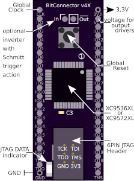
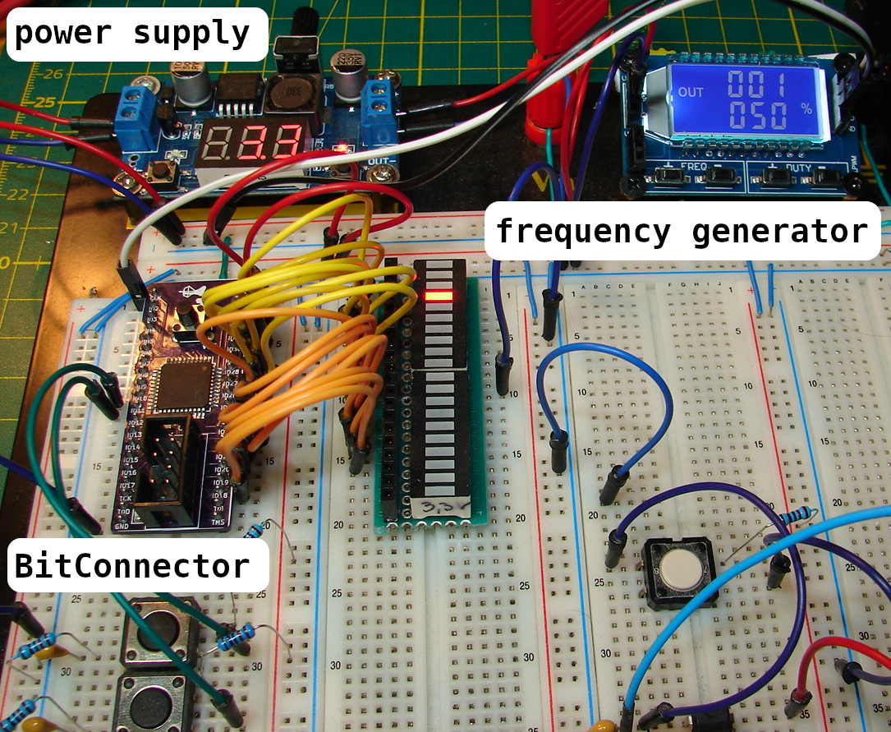

# BitConnector

The BitConnector is a Complex Programmable Logic Device (CPLD) Board, optimized for hardware-based, digital prototype design on a breadboard. 
The BitConnector is designed to represent a classic DIP chip in 2.54mm pitch with 2 * 20 pins. 
Configurations that are present in an HDL/schematic are transmitted via JTAG and stored permanently on the CPLD.

<table><tr>
<td>    </td>
<td>    </td>
<td>    </td>
</tr></table>

## Usage 
Example experimental setup:

For more, please see the documentation (Board_Doc_v1_germ.pdf)

|    |           |          |           |            |          |                   |
| :- | :-------: | :------: | :-------- | :--------: | :------: | :---------------- |
| **Nr** | **DIP-left**  | **CPLD-Pin** | **comment**   | **DIP-right**  | **CPLD-Pin** | **comment**           |
| 1  |    CLK    |    1     | GCK3      |    3V3     |  15,35   | VccINT |
| 2  |    IO2    |    2     |           |    VCC     |    26    | VccIO  |
| 3  |    IO3    |    3     |           |    IO33    |    44    | GCK2              |
| 4  |    IO4    |    5     |           |    IO32    |    43    | GCK1              |
| 5  |    IO5    |    6     |           |    IO31    |    42    |                   |
| 6  |    IO6    |    7     |           |    IO30    |    41    |                   |
| 7  |    IO7    |    8     |           |    IO29    |    40    |                   |
| 8  |    IO8    |    12    |           |    IO28    |    39    |                   |
| 9  |    IO9    |    13    |           |    IO27    |    38    |                   |
| 10 |   IO10    |    14    |           |    IO26    |    37    |                   |
| 11 |   IO11    |    16    |           |    IO25    |    36    | GTS1              |
| 12 |   IO12    |    18    |           |    IO24    |    34    | GTS2              |
| 13 |   IO13    |    19    |           |    IO23    |    32    |                   |
| 14 |   IO14    |    20    |           |    IO22    |    31    |                   |
| 15 |   IO15    |    21    |           |    IO21    |    30    |                   |
| 16 |   IO16    |    22    |           |    IO20    |    29    |                   |
| 17 |   IO17    |    23    |           |    IO19    |    28    |                   |
| 18 |    TCK    |    11    | JTAG      |    IO18    |    27    |                   |
| 19 |    TDO    |    24    | JTAG      |    TDI     |    9     | JTAG              |
| 20 |    GND    | 17,25,4  |           |    TMS     |    10    | JTAG              |

GSR=Global Reset, GTS=Global Tri-State, GCK=Global Clock

## Build

The BitConverter was designed in a minimal configuration with commercially available components.
The bracketed components are optional for schmitt trigger action.
In addition to the schematic, the gerber files for board production was also published.

|       |                               |               |               |               |
| :-    | :---------------------------: | :--------:    | :---------:   |   :---------: |
|   Nr  |   component                   |  value        |   quantity    |   package     |
|   1   |   Unpolarized capacitor       |   100nF       |   3           |   0603        |
|  (2)  |   Unpolarized capacitor       |   100nF       |   1           |   0603        |
|   3   |   LED                         |   blue        |   1           |   1206        |
|   4   |   Resistor                    |   10K         |   4           |   0805        |
|  (5)  |   Resistor                    |   100K        |   1           |   0805        |
|  (6)  |   Resistor                    |   10K         |   1           |   0805        |
|  (7)  |   74LVC2G14                   |   Schmitt-Tr  |   1           |   SOT363      |
|   8   |   Resistor                    |   120         |   1           |   0805        |
|   9   |   Push button                 |   6 mm        |   1           |   THT         |
|   10  |   Pin Header 1x20             |   2,54 mm     |   2           |   vertical    |
|   11  |   XC9536XL/XC9572XL           |   CPLD        |   1           |   VQ44        |

## Licence
This project is distributed in the hope that it will be useful, but WITHOUT ANY WARRANTY.

This project is free: you can redistribute it and/or modify
it under the terms of [CC BY-SA 4.0](https://creativecommons.org/licenses/by-sa/4.0/deed.de)
Excluded from this license is the logo(./doc/Figures/Logo.pdf).
Should you change or delete something, please remove the logo.

