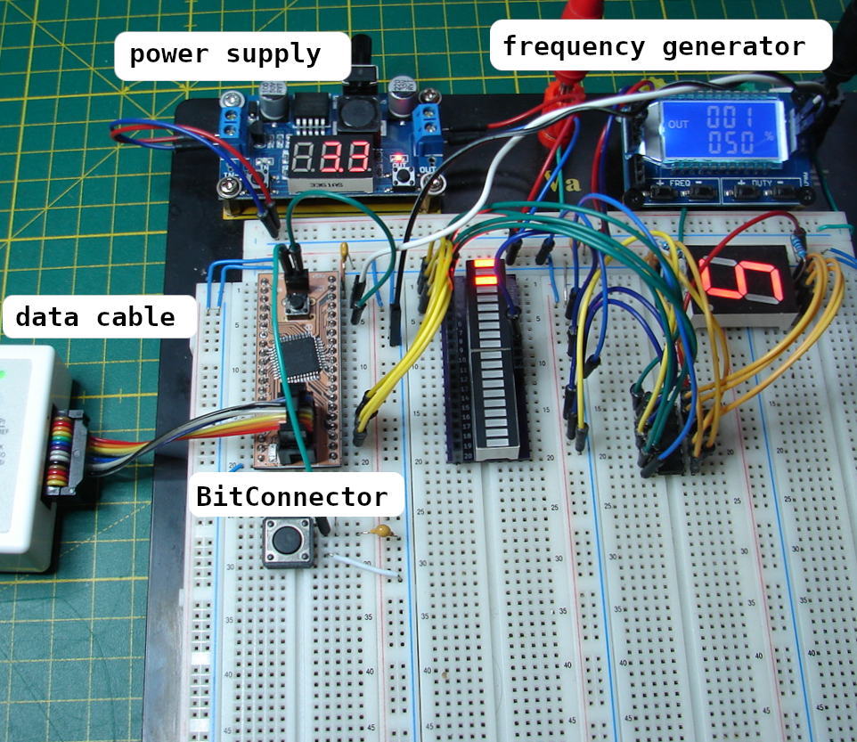

*„Jede Lösung eines Problems ist ein neues Problem.“ - J. W. Goehte*

# BitConnector

The BitConnector is a Complex Programmable Logic Device (CPLD) Board, optimized for hardware-based, digital prototype design on a breadboard.
The BitConnector is designed to represent a classic DIP chip in 2.54mm pitch with 2 * 20 pins. 
Configurations that are present in an HDL/schematic are transmitted via JTAG and stored permanently on the CPLD.

<table><tr>
<td>    </td>
<td>    </td>
<td>    </td>
<td>    </td>
</tr></table>

## Usage & Documentation

Like every IC the BitConnector needs a clean operating voltage without ripple.
In practice, the following methods have proven successful:

- Protect the 3V3 Pin with 100nf and 10nf capacitors against GND.
- Keep the 3V3 and GND connections short and stable.
- Avoid long signal and test leads (up to 25 cm) to the inputs during operation.
- If you have problems with a clean clock on a GCK pin, disable the special globally routed nets as described [here](https://www.xilinx.com/support/documentation/sw_manuals/help/iseguide/mergedProjects/destech/html/cd_using_global_nets.htm).

Example experimental setup:

- there is a detailed German board [documentation](doc/Board_Doc_German.pdf)
- here is the preview for the [schematic](doc/schematic_v5Xe.pdf)
- files for board production have also been published in [Gerber](gerbers/gerbers_v5Xe.zip) format
- for a revision overview check: [changelog](changelog.txt)
- for all other questions, study the Kicad project.

|    |          |           |            |          |                   |
| :- | :------: | :-------- | :--------: | :------: | :---------------- |
| **DIP-left**  | **CPLD-Pin** | **function**   | **DIP-right**  | **CPLD-Pin** | **function** |
| 1  |    1     |GPIO, GCK3|      1      |  15,35   | 3V3/VccINT |
| 2  |    2     | GPIO     |      2      |    26    | VCC VccIO  |
| 3  |    3     | GPIO     |      3      |    44    | GPIO, GCK2            |
| 4  |    5     | GPIO     |      4      |    43    | GPIO, GCK1            |
| 5  |    6     | GPIO     |      5      |    42    | GPIO                  |
| 6  |    7     | GPIO     |      6      |    41    | GPIO                  |
| 7  |    8     | GPIO     |      7      |    40    | GPIO                  |
| 8  |    12    | GPIO     |      8      |    39    | GPIO                  |
| 9  |    13    | GPIO     |      9      |    38    | GPIO                  |
| 10 |    14    | GPIO     |      10     |    37    | GPIO                  |
| 11 |    16    | GPIO     |      11     |    36    | GPIO, GTS1            |
| 12 |    18    | GPIO     |      12     |    34    | GPIO, GTS2            |
| 13 |    19    | GPIO     |      13     |    32    | GPIO                  |
| 14 |    20    | GPIO     |      14     |    31    | GPIO                  |
| 15 |    21    | GPIO     |      15     |    30    | GPIO                  |
| 16 |    22    | GPIO     |      16     |    29    | GPIO                  |
| 17 |    23    | GPIO     |      17     |    28    | GPIO                  |
| 18 |    11    | TCK      |      18     |    27    | GPIO                  |
| 19 |    24    | TDO      |      19     |    9     | TDI                   |
| 20 |  17,25,4 | GND      |      20     |    10    | TMS                   |                                                      |

Supplements and notes:

- **GPIO**=General Purpose In/Output, **GRS**=Global Reset, **GTS**=Global Tri-State, **GCK**=Global Clock, **TDI**=Test Data In, **TDO**=Test Data Out, **TCK**=Test Clk, **TMS**=Test Mode Select, VccINT=Supply voltage internal logic, VccIO=Supply voltage output driver
- Pin 33 is connected to the onboard push-button with GRS.
- With hardware debouncing, the push-button is high-active, otherwise it is low-active.

## Build

|       |                               |               |               |               |
| :-    | :---------------------------: | :--------:    | :---------:   |   :---------: |
|   No  |   component                   |  value        |   quantity    |   package     |
|   1   |   Unpolarized capacitor       |   100nF       |   3           |   0603        |
|   2   |   Unpolarized capacitor       |   10nF        |   3           |   0603        |
|  (3)  |   Unpolarized capacitor       |   100nF       |   1           |   0603        |
|  (4)  |   Resistor                    |   100K        |   1           |   0805        |
|  (5)  |   Resistor                    |   10K         |   1           |   0805        |
|   6   |   Resistor                    |   10K         |   4           |   0805        |
|   7   |   Resistor                    |   120         |   1           |   0805        |
|   8   |   LED                         |   blue        |   1           |   1206        |
|   9   |   Push button                 |   6 mm        |   1           |   THT         |
|   10  |   Pin Header 1x20             |   2.54 mm     |   2           |   vertical    |
|   11  |   IDC Header 2x3              |   2.54 mm     |   1           |   vertical    |
|  (12) |   Pin Socket 1x2              |   2.54 mm     |   1           |   vertical    |
|  (13) |   74LVC2G14                   |   Schmitt-Tr  |   1           |   SOT457      |
|   14  |   XC9536XL/XC9572XL           |   CPLD        |   1           |   VQ44/VQG44  |

- The components without brackets correspond to the minimum configuration (without hardware debouncing).
- You can use the [XC9536XL](https://www.xilinx.com/support/documentation/data_sheets/ds058.pdf) or the more powerful [XC9572XL](https://www.xilinx.com/support/documentation/data_sheets/ds057.pdf) CPLD.
- The BitConverter was designed in a minimal configuration with commercially available components.
- The bracketed components are optional for hardware debouncing/Schmitt trigger action via [74LVC2G14](https://assets.nexperia.com/documents/data-sheet/74LVC2G14.pdf).
- If you make the board without hardware debouncing, please set the solderjumper J1.
- In addition to the schematic, the [Gerber](https://github.com/1ux/BitConnector/raw/master/gerbers/gerbers_v5X.zip) files for board production have also been published.

## Thanks to:

- Jeremy Heighway for mentoring English grammar and spelling.
- [Jana Weigel](https://janaweigel.wordpress.com/) for graphic design consulting, mentoring German grammar and spelling.
- [Lothar Miller](http://www.lothar-miller.de/) for PCB design consulting.
- [mikrocontroller.net](https://www.mikrocontroller.net/topic/492067) for failure analysis and life experience ;).

## Licence
This project by Michael Krause is distributed in the hope that it will be useful, but WITHOUT ANY WARRANTY.

This project is free: you can redistribute it and/or modify
it under the terms of [CC BY-SA 4.0](https://creativecommons.org/licenses/by-sa/4.0/deed.de)
Excluded from this licence is the logo(./doc/Figures/Logo.pdf).
Should you change or delete something, please remove the logo.
